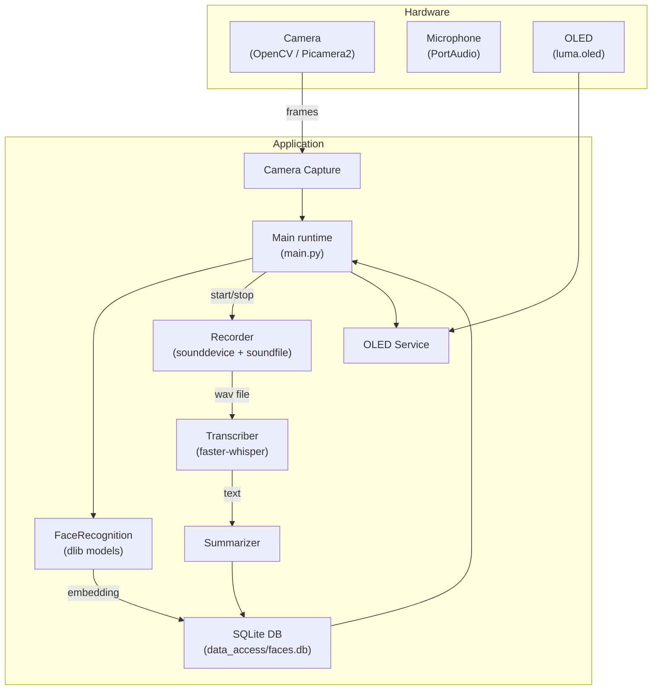
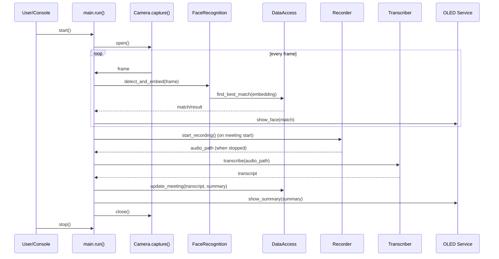
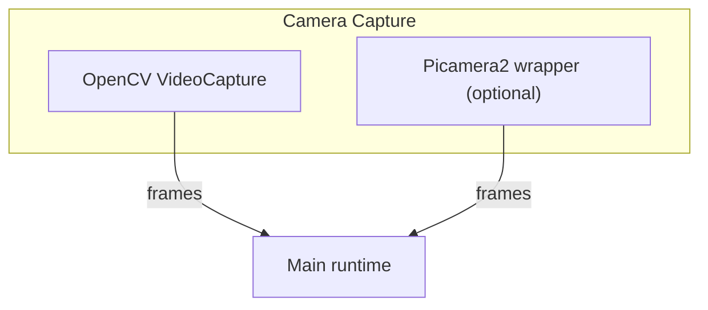
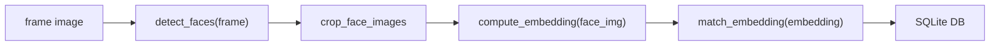
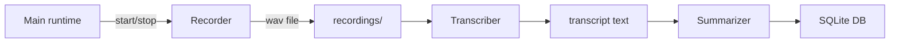
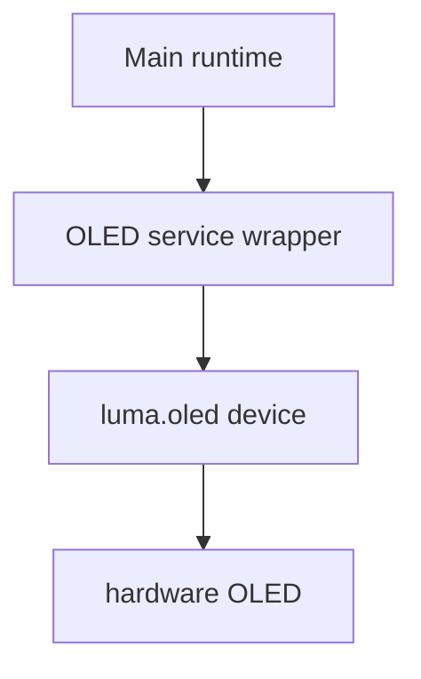

# Architecture: system and subsystem diagrams

This document contains a system-level architecture diagram and per-subsystem diagrams plus concise function-call sequences to make the runtime flow easier to understand and to include in your report. All diagrams are provided as Mermaid blocks so they can be previewed in mermaid.live, GitHub (if enabled), or VS Code Mermaid preview extensions.

Usage notes
- Paste any Mermaid block into https://mermaid.live/ to preview and export SVG/PNG.
- In VS Code, install "Markdown Preview Mermaid Support" or the "Mermaid Markdown Syntax Highlighting and Preview" extension to preview diagrams inline. Use the editor export options or mermaid CLI to render to files.

## System overview



## Subsystem diagrams and function-call sequences

Below are per-subsystem diagrams with concise function-call sequences you can paste into your report or use to illustrate test cases and sequence diagrams.

### 1) Main runtime (orchestration)

Mermaid diagram:



Function-call sequence (concise bullet list):
- main.run()
  - init_camera()
  - open_db()
  - loop: frame <- camera.read() -> FR.detect_faces() -> FR.compute_embedding() -> DB.find_best_match() -> handle matches -> oled.update()
  - meeting start -> recorder.start_recording(), db.create_meeting()
  - meeting stop -> recorder.stop_recording(); transcriber.transcribe(); summarizer.summarize_text(); db.update_meeting()

### 2) Camera Capture subsystem

Mermaid diagram:



Function-call sequence:
- Camera.open() -> selects backend (OpenCV or Picamera2)
- Camera.read() -> returns numpy frame (H,W,3,uint8)
- Camera.close()

Key tests: open/read/close using prerecorded file or virtual device; fallback behavior when primary fails.

### 3) FaceRecognition subsystem

Mermaid diagram:



Function-call sequence:
- detect_faces(frame) -> returns list of bounding boxes
- get_landmarks(face_img) -> landmarks
- compute_embedding(face_img) -> embedding (128-d numpy)
- find_best_match(embedding) -> DB query + distance calculation

### 4) Data access subsystem (database)

Mermaid diagram:

```mermaid
flowchart LR
  App["App modules"] -->|open_db()| DB["SQLite DB"]
  DB --> Faces["faces table"]
  DB --> Emb["face_embeddings table"]
  DB --> Meet["meetings table"]
```

Function-call sequence (representative):
- conn = open_db(path)
- ensure_all_schemas(conn)
- add_face(conn, name, metadata)
- add_embedding(conn, face_id, embedding_blob, ts)
- create_meeting(conn, start_ts, audio_path)
- update_meeting(conn, transcript, summary)

### 5) Audio analysis (Recorder / Transcriber / Summarizer)

Mermaid diagram:



Function-call sequence:
- Recorder.start_recording(path) -> begin InputStream callback
- Recorder.stop_recording() -> flush and close file, return path
- Transcriber.transcribe(wav_path) -> text
- Summarizer.summarize_text(text) -> summary

### 6) OLED output subsystem

Mermaid diagram:



Function-call sequence:
- get_display() -> returns _LumaDisplay or _DummyDisplay
- display.show_face(name, score) -> draws to canvas and flushes
- display.show_summary(text)

### 7) CLI tooling (add_face / manage_embeddings / visualize_db)

Mermaid diagram:

```mermaid
flowchart LR
  CLI["add_face/manage_embeddings/visualize_db"] --> data_access.open_db()
  CLI --> FaceRecognition["embedding creation helpers"]
  CLI --> DB["SQLite DB"]
```

Function-call sequence:
- add_face(images...) -> load images -> compute embeddings -> insert face + embeddings into DB
- manage_embeddings prune -> list embeddings -> delete oldest
- visualize_db -> query DB -> write report (CSV/PNG)

---

If you'd like, I can also:
- Commit this file into `docs/architecture.md` (done) and render SVG/PNGs for each Mermaid block and add them to `docs/`.
- Produce PlantUML files / PNG exports instead of Mermaid.

Tell me whether you want rendered SVG/PNGs committed and which format you prefer (Mermaid SVGs or PlantUML PNGs). If you want SVGs I can generate them and add them to `docs/` next.
