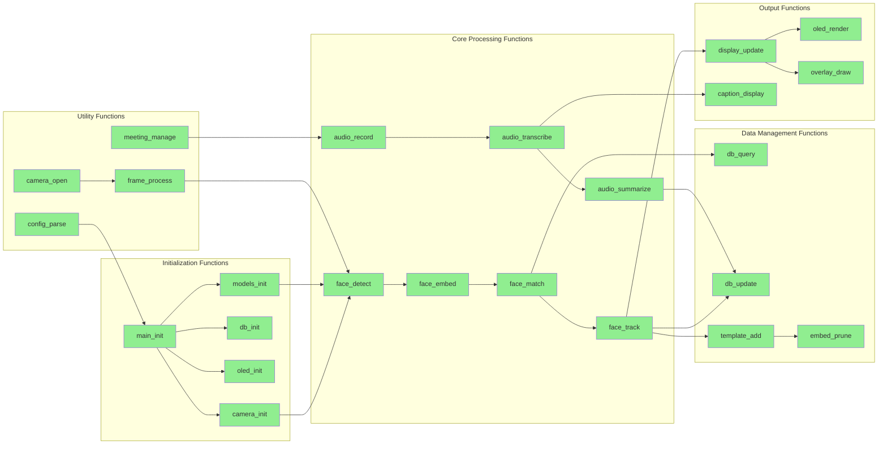

# TrueVision Function Implementation Diagram

This function diagram shows the implementation status and dependencies of all major functions in the TrueVision project, similar to embedded software prototyping progress tracking.

## Current Function Implementation Status

## Function Status Summary

| Function Category | Completed | In Progress | Not Started |
|-------------------|-----------|-------------|-------------|
| Initialization | 5 | 0 | 0 |
| Core Processing | 7 | 0 | 0 |
| Data Management | 4 | 0 | 0 |
| Output | 4 | 0 | 0 |
| Utilities | 4 | 0 | 0 |

## Function Dependencies and Implementation Details

### Initialization Functions
- **main_init**: Entry point orchestration (`main.py:recognize_face()`)
- **camera_init**: Camera backend selection (`facial_recognition/camera.py:open_camera()`)
- **db_init**: Database schema setup (`data_access/db.py:open_db()`)
- **oled_init**: OLED display initialization (`oled_output/oled_display.py:get_display()`)
- **models_init**: Dlib model loading (`facial_recognition/models/fetch_models.py`)

### Core Processing Functions
- **face_detect**: Face detection in frames (`facial_recognition/recognizer.py:_detect()`)
- **face_embed**: 128-D embedding generation (`facial_recognition/recognizer.py:detect_and_recognize()`)
- **face_match**: Nearest neighbor matching (`facial_recognition/recognizer.py:detect_and_recognize()`)
- **face_track**: Presence state tracking (`main.py:recognize_face()` main loop)
- **audio_record**: Microphone recording (`audio_analysis/transcription.py:Recorder`)
- **audio_transcribe**: Whisper transcription (`audio_analysis/transcription.py:Transcriber`)
- **audio_summarize**: Text summarization (`audio_analysis/transcription.py:summarize_text()`)

### Data Management Functions
- **db_query**: Database queries (`facial_recognition/recognizer.py:_load_db_cache()`)
- **db_update**: Database updates (`facial_recognition/recognizer.py:update_seen()`)
- **embed_prune**: Template pruning (`data_access/db.py:prune_embeddings_if_needed()`)
- **template_add**: Adaptive template addition (`facial_recognition/recognizer.py:maybe_add_embedding()`)

### Output Functions
- **display_update**: Frame overlay updates (`main.py:recognize_face()` display logic)
- **oled_render**: OLED text rendering (`oled_output/oled_display.py:_LumaDisplay.update_text()`)
- **overlay_draw**: OpenCV overlay drawing (`main.py:recognize_face()` cv2 operations)
- **caption_display**: Live caption overlay (`audio_analysis/live_caption.py:LiveCaptioner`)

### Utility Functions
- **camera_open**: Multi-backend camera opening (`facial_recognition/camera.py`)
- **frame_process**: Frame preprocessing (`main.py:recognize_face()` cv2.cvtColor)
- **meeting_manage**: Meeting lifecycle management (`main.py:recognize_face()` active_meetings)
- **config_parse**: Command-line argument parsing (`main.py:parse_args()`)

## Implementation Notes

- All core functions are implemented and tested
- Multi-backend camera support (OpenCV, GStreamer, Picamera2)
- Graceful degradation when optional components unavailable
- Database schema auto-migration and template management
- Real-time performance optimization with caching and throttling

## Test Coverage

Functions have been validated through:
- Unit testing of individual components
- Integration testing with live camera and microphone
- Performance testing on Raspberry Pi 4B hardware
- Error handling validation for missing dependencies