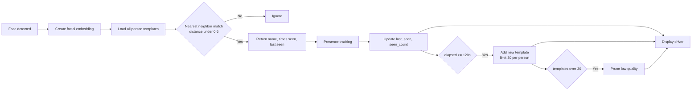
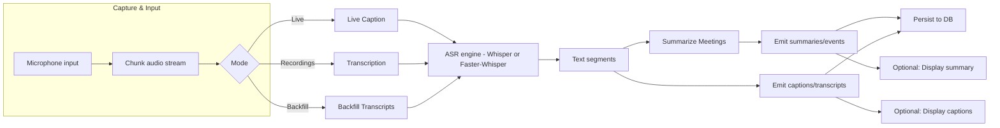
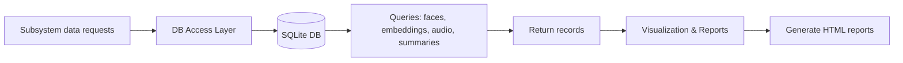
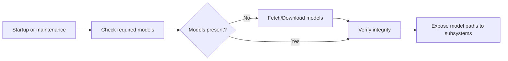
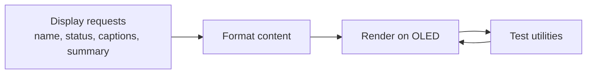
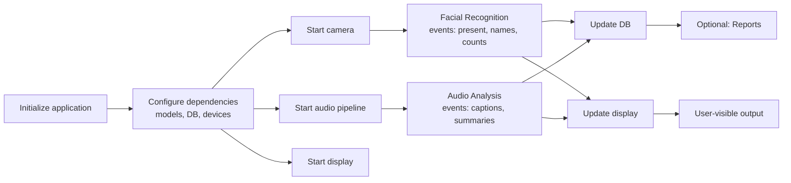

# TrueVision Subsystem Diagrams

These high-level flow diagrams summarize each subsystem at a similar level of detail to the facial recognition example. They are intended for audiences with minimal project knowledge.

## Facial Recognition

## Audio Analysis

## Data Access

## Model Management

## OLED Output

## Main Orchestration

